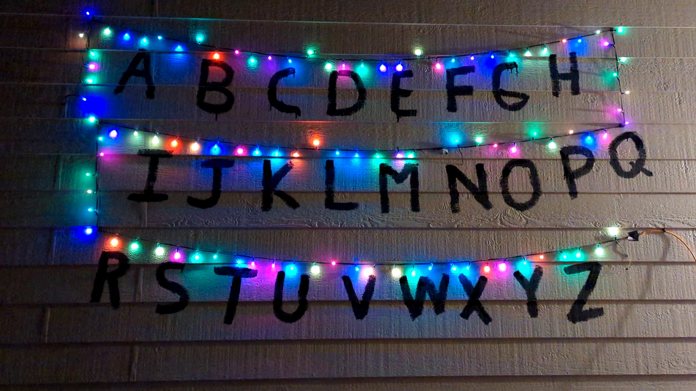

# Life-Sized Outdoor Stranger Things LED Wall

An Arduino software that controlls a WS2811 LED strip to spell things out with letters painted on my wall.

## Components

- **WS2811 LEDs**: 100 units
- **Cable**: Literally any cable that you can use to transmit the power and data.
- **Arduino Pro Micro**: Used as the controller
- **Weatherproofing**: Using a cooler and a brick to protect from elements
  
## License
https://opensource.org/license/gpl-3-0

## Acknowledgments

Thanks for checking out this project! If you have any questions or suggestions, please feel free to reach out.

I do not own nor am I affiliated with Netflix or Stranger Things in ANY WAY, I just like the show.
